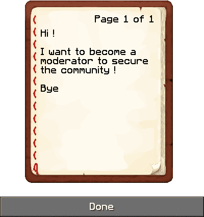
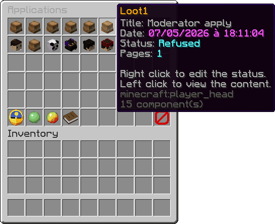
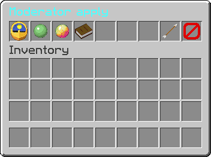

# Quill - Minecraft Plugin

Quill is a Minecraft plugin that modernizes a **very old-school server workflow**: players write something in a signed book, submit it, and the staff team reviews it later through an in-game interface.

I created this plugin because, when I was younger, the first Minecraft server I truly spent time on had a long-term progression system based on applications written in books. Players would write their application in-game, drop the signed book into a hopper, and admins would read it afterwards.

Even if its main use case is player applications, the system can also be used for many other book-based submissions: whitelist forms, staff applications, roleplay backstories, reports, event registrations, lore entries, or any other workflow where players need to submit structured written content.

Quill keeps the original charm of Minecraft book submissions while removing the awkward parts of the old process.

## 📋 Features

### 📖 Submission System
- Submit signed books directly with `/quill apply`
- Save book title, content, author UUID, date, and status in MySQL
- Read submitted books back in-game through the written book interface



### 🧭 Review & Moderation
- Browse all submissions in a paginated GUI
- Browse a specific player's submissions with `/quill look <player>`
- Let players review their own submissions with `/quill self`
- Change submission status from a dedicated management GUI
- Filter the global list by status using GUI toggle buttons




### 🔧 Advanced Features
- Full permission management
- Async database access for submission loading and browsing
- Reload configuration without restarting the server
- Staff notification on join when pending submissions exist
- Fully customizable messages, GUI titles, item names, and status labels

<p>
  
  
</p>

### 🤖 Discord Integration
- Optional webhook notification for new submissions
- Includes author name, title, and page count
- Safe fallback if webhook sending fails

## 🚀 Installation

### Requirements
- Spigot/Paper Minecraft server 1.20.6 or higher
- Java 21 or higher
- MySQL database access

### Steps
1. Download the latest plugin JAR
2. Place the JAR file in the plugins folder
3. Start or restart the server once to generate `plugins/Quill/config.yml`
4. Configure the MySQL connection settings
5. Optionally set a Discord webhook URL
6. Restart the server

## ⚙️ Configuration

### Main Files
- `plugins/Quill/config.yml` — General configuration for messages, GUI text, statuses, database connection, and Discord webhook

### Commands
| Command | Permission | Description                                       |
|---------|------------|---------------------------------------------------|
| `/quill` | `quill.look` | Opens the global applications GUI                 |
| `/quill apply` | `quill.apply` | Submits the signed book in the player's main hand |
| `/quill look <player>` | `quill.look` | Opens the applications of a specific player       |
| `/quill self` | `quill.self` | Displays the player's own submitted books         |
| `/quill reload` | `quill.reload` | Reloads the configuration                         |

### Permissions
| Permission | Description | Default |
|------------|-------------|---------|
| `quill.*` | Grants all plugin permissions | OP |
| `quill.apply` | Allows submitting a signed book | OP |
| `quill.look` | Allows browsing submissions | OP |
| `quill.notify` | Allows receiving pending/new submission notifications | OP |
| `quill.reload` | Allows reloading the plugin configuration | OP |
| `quill.status` | Allows changing the status of a submission | OP |
| `quill.self` | Allows viewing your own submissions | OP |

## 🎨 Customization

### Menus & Messages
- Customizable messages under `messages`
- Customizable GUI labels under `menus`
- Customizable status names under `settings.status`
- Custom status colors in the application management menu

### Status Workflow
Quill currently supports four submission states:

- `Pending`
- `Accepted`
- `Refused`
- `Archived`

## 📊 Settings Reference

```yaml
messages:
  configuration-reload: '&7Configuration has been reloaded.'
  apply-done: '&7Application &d%title%&7 has been submitted.'

settings:
  status:
    waiting: 'Pending'
    accepted: 'Accepted'
    refused: 'Refused'
    archived: 'Archived'

database:
  username: 'your_username'
  password: 'your_password'
  name: 'your_database'
  url: 'localhost:3306'

discord:
  webhook-url: ''
```

## 🔗 Discord Webhook Setup

1. Create a webhook in your Discord channel settings
2. Paste its URL into `discord.webhook-url`
3. Restart the server or run `/quill reload`
4. Submit a signed book with `/quill apply`

### Webhook Message Content
When enabled, Quill sends a message containing:

- the author name
- the book title
- the page count

## 🗂️ Project Structure

```
src/main/java/fr/loot1/quill/
├── Quill.java                          # Main plugin class
├── commands/
│   └── QuillCommand.java               # /quill command handler
├── guis/
│   ├── GuiApplicationManager.java      # Status management GUI
│   ├── GuiApplications.java            # Global applications GUI
│   ├── GuiHolder.java                  # Shared GUI utilities
│   ├── GuiPaginatedApplications.java   # Paginated GUI base class
│   └── GuiPlayerApplications.java      # Player-specific applications GUI
├── listeners/
│   ├── GuiListener.java                # GUI event listener
│   └── PlayerJoinListener.java         # Pending applications notification on join
├── managers/
│   ├── ConfigManager.java              # Config file manager
│   ├── DatabaseManager.java            # MySQL access and persistence
│   └── PlayerCacheManager.java         # Cached player names for tab completion
├── objects/
│   ├── Application.java                # Submission data model
│   └── ApplicationList.java            # Paginated result wrapper
└── utils/
    ├── DiscordWebhook.java             # Discord webhook HTTP client
    └── GlowHelper.java                 # GUI glow helper
```

## Dependencies

| Dependency           | Type | Notes |
|----------------------|------|-------|
| HikariCP             | Library | Database connection pooling |
| Gson                 | Library | Book content serialization |
| MySQL                | External service | Required for storage |
| Spigot/Paper 1.20.6+ | Server | — |
| Java 21+             | Runtime | — |

## Authors

| Role | Author                                 |
|------|----------------------------------------|
| Plugin design, development, and implementation | [**Loot1**](https://github.com/Loot1) |